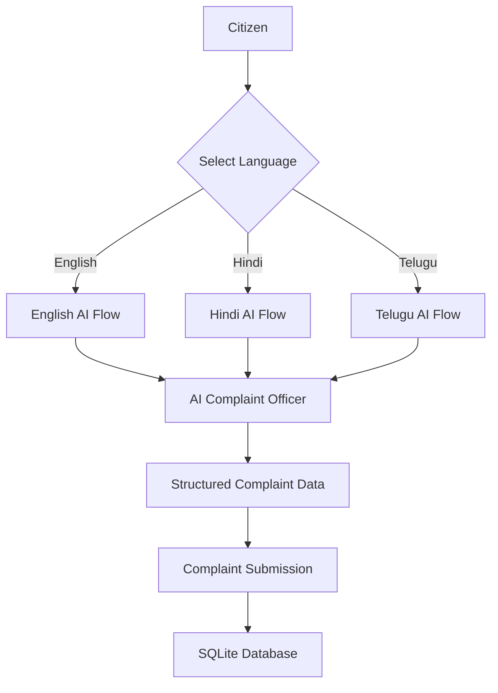
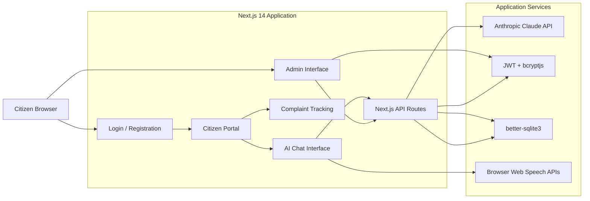
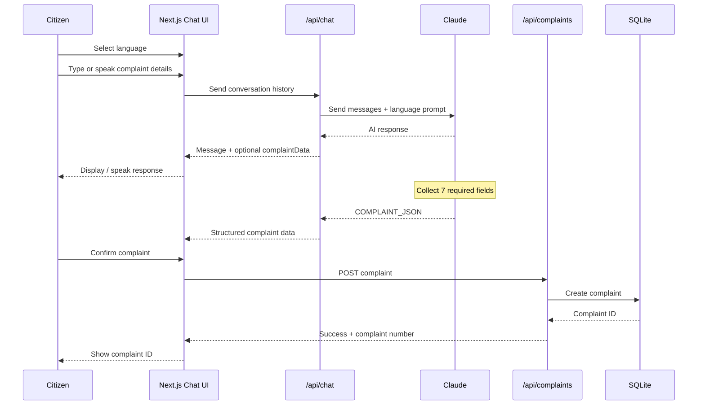
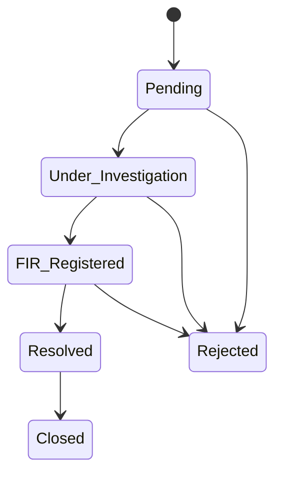
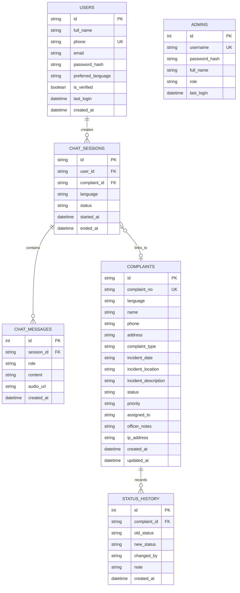
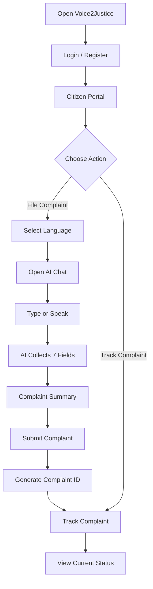
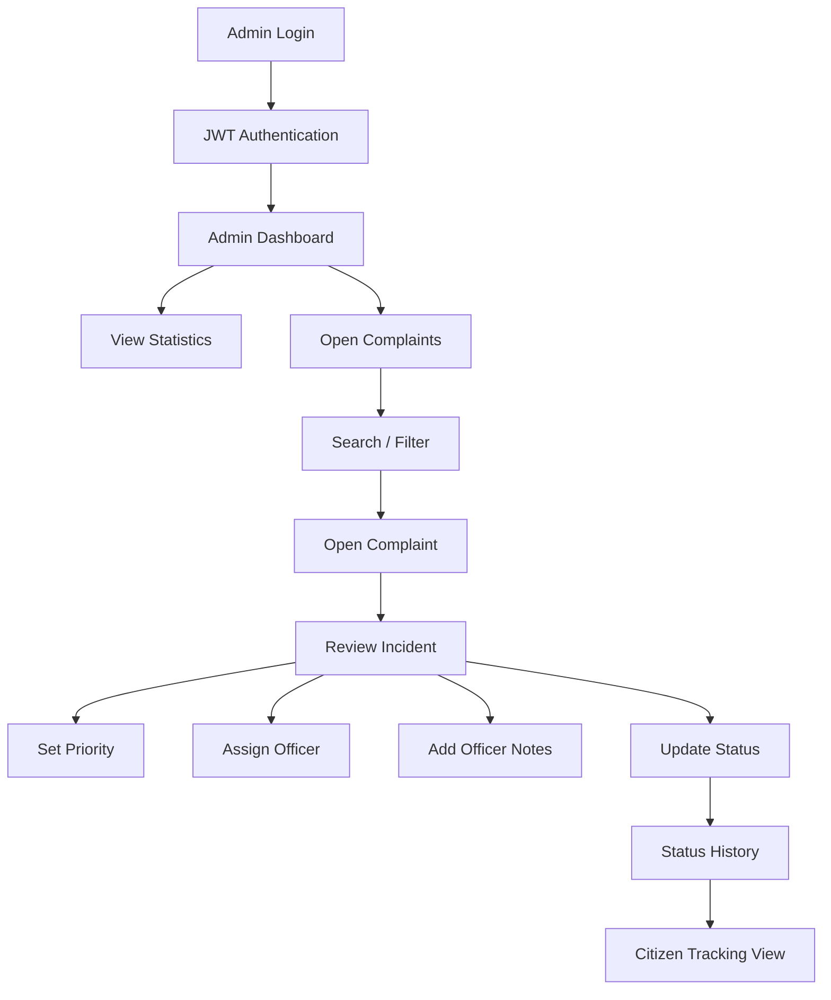

# 🛡️ Voice2Justice — Multilingual AI Police Complaint Portal

> **Voice2Justice** is a full-stack, multilingual AI-powered police complaint portal that helps citizens file complaints through a conversational AI officer instead of navigating complicated forms. The application supports **English, Hindi, and Telugu**, provides **voice input and text-to-speech assistance**, generates structured complaint data through Claude AI, stores complaints in SQLite, and provides an authenticated administration dashboard for case management.

---

## 🔗 Project

- **Repository:** `https://github.com/Naveenbabu45/voice2justice`
- **Project Folder:** `complaint-portal/`
- **Application Type:** Full-Stack Web Application
- **Primary Use Case:** AI-assisted police complaint registration and case tracking

---

## ✨ Why Voice2Justice?

Traditional complaint portals can require citizens to understand long forms, technical terminology, and multiple fields before submitting a complaint.

Voice2Justice changes that interaction into a guided conversation:

```text
Citizen
   │
   ▼
Choose Language
   │
   ▼
Talk / Type to AI Complaint Officer
   │
   ▼
AI collects required information
   │
   ▼
Complaint summary generated
   │
   ▼
Citizen submits complaint
   │
   ▼
Unique Complaint ID
   │
   ▼
Track complaint progress
```

The project is designed around **accessibility, multilingual interaction, conversational data collection, structured complaint handling, and administrative visibility**.

---

# 🚀 Core Features

## 👤 Citizen Experience

- Multilingual interface in:
  - 🇬🇧 English
  - 🇮🇳 Hindi
  - 🌟 Telugu
- Citizen registration and login using phone number and password
- Preferred language stored with the user account
- AI-guided complaint filing
- Conversational collection of complaint information
- Complaint summary before submission
- Unique complaint number generated after successful submission
- Public complaint tracking using complaint ID
- Complaint status progress timeline
- Access to previous chat sessions through the session system

## 🤖 AI Complaint Officer

The AI officer uses Anthropic Claude to guide the citizen through complaint registration.

It collects seven structured fields:

1. Full name
2. Phone number
3. Complete address
4. Complaint type
5. Incident date/time
6. Incident location
7. Detailed incident description

Supported complaint categories include:

- Theft
- Assault / Physical Violence
- Fraud / Cheating
- Missing Person
- Cybercrime
- Domestic Violence
- Harassment
- Vandalism / Property Damage
- Accident
- Other

The AI is instructed to:

- Ask one question at a time
- Validate the citizen's response
- Ask for clarification when information is unclear
- Maintain a supportive conversational tone
- Keep responses concise
- Produce structured `COMPLAINT_JSON` only after all required fields are available

---

# 🎙️ Voice Interaction

Voice2Justice includes browser-based voice capabilities.

### Voice Input

The chat interface uses the browser's:

```text
SpeechRecognition / webkitSpeechRecognition
```

Language mappings:

| Language | Speech Recognition |
|---|---|
| English | `en-IN` |
| Hindi | `hi-IN` |
| Telugu | `te-IN` |

If the browser does not support speech recognition, the application displays an appropriate fallback message.

### Text-to-Speech

AI responses can also be read aloud using:

```text
window.speechSynthesis
SpeechSynthesisUtterance
```

The interface supports:

- Voice on/off
- Speech speed selection
- Volume control
- Language-specific voice selection
- Stop/replay behavior for active speech

> Voice functionality depends on browser support and the voices available on the user's device.

---

# 🌐 Multilingual Architecture

Language configuration is centralized in `lib/constants.js`.



The same complaint workflow is reused across all three supported languages.

---

# 🏗️ System Architecture



---

# 🔄 Complaint Filing Workflow



---

# 🧠 AI Data Extraction Flow

The AI response can contain a structured marker:

```text
COMPLAINT_JSON:{...}
```

The server:

1. Sends the conversation to Claude.
2. Receives the AI response.
3. Detects the `COMPLAINT_JSON` marker.
4. Parses the JSON.
5. Removes the internal marker from the visible message.
6. Returns:
   - Human-readable AI response
   - Structured complaint data
   - API usage information

Conceptually:

```mermaid
flowchart TD
    A[Conversation History] --> B[/api/chat]
    B --> C[Claude]
    C --> D[AI Response]

    D --> E{COMPLAINT_JSON present?}

    E -->|No| F[Return normal response]
    E -->|Yes| G[Parse JSON]
    G --> H[Return message + complaintData]

    H --> I[Complaint Summary]
    I --> J[Citizen Submission]
```

---

# 📝 Complaint Data Model

A complaint contains the following major information:

```text
Complaint
├── id
├── complaint_no
├── language
├── name
├── phone
├── address
├── complaint_type
├── incident_date
├── incident_location
├── incident_description
├── status
├── priority
├── assigned_to
├── officer_notes
├── ip_address
├── created_at
└── updated_at
```

The application generates complaint numbers in the form:

```text
CMP + YYYY + MM + 5-digit random number
```

Example:

```text
CMP20240512345
```

---

# 📊 Complaint Status Lifecycle

Supported statuses:

```text
Pending
   │
   ▼
Under Investigation
   │
   ▼
FIR Registered
   │
   ▼
Resolved
   │
   ▼
Closed
```

The system also supports:

```text
Rejected
```

Each status update can create a corresponding entry in the status history.



---

# 🔍 Complaint Tracking

Citizens can enter their complaint number on:

```text
/track
```

The tracking flow:

```mermaid
flowchart LR
    A[Complaint ID] --> B[/track]
    B --> C[GET /api/complaints/:id]
    C --> D{Complaint Found?}
    D -->|No| E[Show Error]
    D -->|Yes| F[Return Safe Complaint View]
    F --> G[Status + Complaint Details]
    G --> H[Status Progress Timeline]
```

For public tracking, sensitive administrative fields such as:

- IP address
- Officer notes

are excluded from the public response.

---

# 👮 Administration & Case Management

The application contains a dedicated administrative interface.

## Admin capabilities

### Dashboard

The dashboard provides complaint statistics including:

- Total complaints
- Pending complaints
- Active complaints
- Resolved / closed complaints
- Today's complaints
- Last 7 days
- Complaint types
- Complaint statuses
- Complaint languages
- Recent complaints
- Daily complaint activity

### Complaint Management

Administrators can:

- Search complaints
- Filter by status
- Filter by language
- Open complaint details
- Update complaint status
- Add status notes
- Set priority
- Assign an officer
- Add internal officer notes
- View complaint activity history
- Open a public tracking view
- Print complaint details

---

# 🔐 Authentication & Security

The project implements several application-level security mechanisms.

## Citizen Authentication

Citizen accounts support:

```text
Phone Number
      +
Password
      │
      ▼
bcrypt password verification
      │
      ▼
JWT token
      │
      ▼
Authenticated citizen session
```

## Admin Authentication

Admin authentication uses:

- Username/password login
- bcrypt password hashing
- JWT tokens
- HttpOnly cookie support
- Bearer token support
- Token expiration

JWT tokens are configured with an **8-hour expiry**.

### Password Storage

Passwords are hashed using:

```text
bcryptjs
```

Passwords are not stored as plaintext.

### Public Data Protection

The public complaint tracking API removes administrative/sensitive fields before returning complaint information.

---

# 🗃️ Database Architecture

Voice2Justice uses:

```text
SQLite
   │
   └── better-sqlite3
```

The database is automatically initialized when the application starts accessing the database.

## Main tables



---

# 📁 Project Structure

```text
complaint-portal/
│
├── app/
│   ├── page.js
│   │
│   ├── login/
│   │   └── page.js
│   │
│   ├── citizen/
│   │   └── page.js
│   │
│   ├── chat/
│   │   └── page.js
│   │
│   ├── track/
│   │   └── page.js
│   │
│   ├── police/
│   │   └── page.js
│   │
│   ├── admin/
│   │   ├── page.js
│   │   ├── layout.js
│   │   ├── dashboard/
│   │   │   └── page.js
│   │   └── complaints/
│   │       ├── page.js
│   │       └── [id]/
│   │           └── page.js
│   │
│   └── api/
│       ├── auth/
│       │   └── route.js
│       ├── users/
│       │   └── route.js
│       ├── chat/
│       │   └── route.js
│       ├── sessions/
│       │   └── route.js
│       ├── complaints/
│       │   ├── route.js
│       │   └── [id]/
│       │       └── route.js
│       └── stats/
│           └── route.js
│
├── components/
│   └── AdminSidebar.js
│
├── lib/
│   ├── auth.js
│   ├── constants.js
│   └── db.js
│
├── data/
│   └── complaints.db
│
├── .env.example
├── .gitignore
├── jsconfig.json
├── next.config.js
├── postcss.config.js
├── tailwind.config.js
├── setup.sh
└── package.json
```

---

# 🔌 API Reference

| Method | Endpoint | Purpose | Access |
|---|---|---|---|
| `POST` | `/api/users` | Register citizen | Public |
| `PATCH` | `/api/users` | Citizen login | Public |
| `POST` | `/api/auth` | Admin login | Public |
| `GET` | `/api/auth` | Verify admin token | Admin |
| `DELETE` | `/api/auth` | Admin logout | Admin |
| `POST` | `/api/chat` | AI conversation | Public |
| `POST` | `/api/sessions` | Create chat session | Public / optional user |
| `GET` | `/api/sessions?id=...` | Retrieve chat history | Session based |
| `PATCH` | `/api/sessions` | Save message / close session | Session based |
| `POST` | `/api/complaints` | Create complaint | Public |
| `GET` | `/api/complaints` | List complaints | Admin |
| `GET` | `/api/complaints/:id` | Track complaint | Public / Admin |
| `PATCH` | `/api/complaints/:id` | Update complaint | Admin |
| `GET` | `/api/stats` | Dashboard statistics | Admin |

---

# 🧩 API Responsibilities

## `/api/chat`

Connects the application to Anthropic Claude.

```text
Frontend
   │
   ├── messages
   └── language
        │
        ▼
   /api/chat
        │
        ▼
   Anthropic Claude
        │
        ▼
   message
   complaintData
```

## `/api/complaints`

Handles complaint creation and administrative listing.

```text
POST
  └── Validate required fields
      └── Validate phone
          └── Generate UUID
              └── Generate complaint number
                  └── Store complaint
                      └── Create initial status history
```

## `/api/complaints/:id`

Supports:

- Public tracking
- Admin complaint retrieval
- Status updates
- Priority updates
- Officer assignment
- Officer notes

## `/api/stats`

Builds dashboard statistics directly from the SQLite database.

---

# 🛠️ Technology Stack

| Layer | Technology |
|---|---|
| Framework | Next.js 14 |
| Rendering / Routing | Next.js App Router |
| Frontend | React 18 |
| Language | JavaScript |
| Styling | Tailwind CSS + custom CSS |
| AI | Anthropic Claude |
| AI SDK | `@anthropic-ai/sdk` |
| Database | SQLite |
| Database Driver | `better-sqlite3` |
| Authentication | JWT |
| Password Hashing | bcryptjs |
| IDs | UUID |
| Date Utilities | date-fns |
| Voice Input | Web Speech API |
| Text-to-Speech | Speech Synthesis API |

---

# ⚙️ Environment Variables

Create a `.env.local` file using `.env.example` as the template.

```env
ANTHROPIC_API_KEY=your_anthropic_api_key_here

DATABASE_PATH=./data/complaints.db

ADMIN_USERNAME=admin
ADMIN_PASSWORD=ChangeMe@2024

JWT_SECRET=your_super_secret_jwt_key_here_change_in_production

NEXT_PUBLIC_APP_URL=http://localhost:3000

NODE_ENV=development
```

### Important

Before using the application beyond local development:

- Replace the default admin password.
- Replace the default JWT secret.
- Keep API keys and secrets outside source control.
- Do not commit `.env.local`.

---

# 🚀 Local Setup

## 1. Clone the repository

```bash
git clone https://github.com/Naveenbabu45/voice2justice.git
cd voice2justice
```

## 2. Enter the application directory

If the repository contains the provided project folder:

```bash
cd complaint-portal
```

## 3. Install dependencies

```bash
npm install --legacy-peer-deps
```

Or use the included setup script:

```bash
chmod +x setup.sh
./setup.sh
```

## 4. Configure environment variables

```bash
cp .env.example .env.local
```

Add your Anthropic API key and replace development secrets.

## 5. Start the development server

```bash
npm run dev
```

## 6. Open the application

```text
http://localhost:3000
```

---

# 🧪 Available Scripts

| Command | Purpose |
|---|---|
| `npm run dev` | Start development server |
| `npm run build` | Create production build |
| `npm start` | Start production server |
| `npm run lint` | Run lint command configured by the project |
| `npm run db:init` | Initialize database script if present in the project setup |

---

# 🖥️ Application Routes

| Route | Purpose |
|---|---|
| `/` | Entry point / redirects to login |
| `/login` | Citizen and officer authentication |
| `/citizen` | Citizen landing / complaint workflow |
| `/chat` | AI complaint conversation |
| `/track` | Complaint tracking |
| `/police` | Police/admin-facing landing interface |
| `/admin` | Admin login |
| `/admin/dashboard` | Complaint analytics |
| `/admin/complaints` | Complaint management |
| `/admin/complaints/:id` | Complaint detail and update screen |

---

# 🔄 End-to-End User Journey



---

# 👮 Admin Workflow



---

# 📈 Dashboard Analytics

The administrative dashboard derives statistics from the complaint database.

Available analytical dimensions include:

```text
Complaint Volume
      │
      ├── Total
      ├── Today
      └── Last 7 Days

Complaint Classification
      │
      ├── Complaint Type
      ├── Status
      └── Language

Case Activity
      │
      ├── Recent Complaints
      └── Daily Activity
```

---

# 🎨 UI & Design

The application uses different visual treatments for citizen and administrative experiences.

### Citizen interface

- Dark blue visual theme
- Accessible typography
- Language controls
- Conversational chat layout
- Voice controls
- Complaint summary cards
- Status tracking timeline

### Administrative interface

- Dark navy / gold theme
- Dashboard cards
- Data tables
- Status indicators
- Complaint detail panels
- Activity logs
- Officer management controls

The project uses fonts such as:

```text
Cinzel
Crimson Pro
Lora
Source Serif 4
Rajdhani
Share Tech Mono
```

---

# 🔒 Data & Privacy Considerations

The implementation includes application-level protections such as:

- bcrypt password hashing
- JWT-based authentication
- HttpOnly authentication cookies
- Bearer token support
- Input validation
- Public response redaction for selected administrative fields
- Database indexes for common complaint/user queries
- Foreign-key relationships in SQLite
- Separate citizen and admin workflows

### Important production consideration

This repository is a project implementation and should receive additional security hardening before deployment in a real law-enforcement environment.

Recommended production work includes:

- Strong secret management
- HTTPS enforcement
- Rate limiting
- CSRF protection where applicable
- Comprehensive authorization checks
- Audit/security monitoring
- Data retention policies
- Encryption at rest where required
- Secure deployment of the database
- Formal privacy and compliance review
- Production-grade database infrastructure

---

# 🧱 Design Principles

Voice2Justice is structured around five core principles:

```text
        ┌───────────────────────┐
        │     ACCESSIBILITY     │
        └───────────┬───────────┘
                    │
       ┌────────────┼────────────┐
       │            │            │
       ▼            ▼            ▼
  Multilingual   Conversational   Voice
       │            │            │
       └────────────┼────────────┘
                    ▼
            Structured Complaints
                    │
                    ▼
             Case Management
                    │
                    ▼
             Status Tracking
```

---

# 📌 Project Highlights

### 1. Conversational Complaint Filing

Instead of forcing users through a large form, the AI officer asks for the required information step-by-step.

### 2. Multilingual Support

The complaint workflow is available in English, Hindi, and Telugu.

### 3. Voice Accessibility

Citizens can use browser-supported speech recognition and listen to AI responses using speech synthesis.

### 4. Structured AI Output

The conversational AI is converted into structured complaint data before the complaint is stored.

### 5. Case Lifecycle Management

Administrators can move complaints through a defined status workflow and maintain status history.

### 6. Analytics

The admin dashboard provides complaint statistics by type, status, language, and time period.

### 7. Complaint Tracking

Citizens can use their generated complaint ID to view progress without exposing selected internal administrative information.

---

# 🗺️ Future Enhancements

Potential improvements based on the current architecture:

- [ ] OTP-based phone verification
- [ ] Email confirmation and complaint receipt
- [ ] SMS / WhatsApp complaint notifications
- [ ] PDF complaint receipt generation
- [ ] PostgreSQL migration for larger deployments
- [ ] Docker-based deployment
- [ ] Production rate limiting
- [ ] More granular officer roles and permissions
- [ ] Advanced audit logging
- [ ] Evidence/document upload
- [ ] Image and document processing
- [ ] Multilingual speech recognition improvements
- [ ] Accessibility enhancements
- [ ] Production monitoring and observability

---

# 📚 Learning Outcomes

This project demonstrates practical experience with:

- Next.js App Router
- React client components
- REST-style API routes
- AI API integration
- Conversational application design
- Prompt-based structured data extraction
- SQLite database design
- CRUD operations
- JWT authentication
- bcrypt password hashing
- Browser speech APIs
- Multilingual UI design
- Admin dashboards
- Complaint lifecycle modeling
- Status history / audit concepts
- Environment-based configuration
- Tailwind CSS and custom responsive styling

---

# ⚠️ Important Notes

1. **Anthropic API access is required** for the AI chat functionality.
2. Voice input depends on browser support for Speech Recognition.
3. Text-to-speech depends on the voices available on the user's device/browser.
4. SQLite is convenient for development and smaller deployments; a production system may require a more scalable database architecture.
5. Default development credentials should be changed before any serious deployment.
6. The application should not be treated as a replacement for official emergency services. For immediate danger or emergencies, users should contact the appropriate emergency service directly.

---

# 👨‍💻 Author

**Naveen Babu**

B.Tech Computer Science & Engineering Student

- GitHub: `https://github.com/Naveenbabu45`
- LinkedIn: `https://www.linkedin.com/in/kommmavarapunaveenbabu`
- Portfolio: `https://naveen-portfolio-swart-rho.vercel.app/`

---

# 📄 License

No explicit open-source license is defined in the provided project files.

If this project is intended for public reuse, add an appropriate `LICENSE` file and update this section accordingly.

---

## ⭐ Project Summary

**Voice2Justice** combines conversational AI, multilingual interaction, browser voice capabilities, structured complaint processing, SQLite persistence, authentication, complaint tracking, and administrative case management into a single full-stack application.

```text
                VOICE2JUSTICE
                      │
        ┌─────────────┼─────────────┐
        ▼             ▼             ▼
   Multilingual   Conversational   Voice
      UI              AI          Support
        │             │             │
        └─────────────┼─────────────┘
                      ▼
             Structured Complaint
                      │
                      ▼
                SQLite Storage
                      │
            ┌─────────┴─────────┐
            ▼                   ▼
      Citizen Tracking     Admin Dashboard
            │                   │
            └─────────┬─────────┘
                      ▼
               Case Management
```

> Built as a practical full-stack project exploring how AI and accessible interfaces can simplify public-service workflows.
